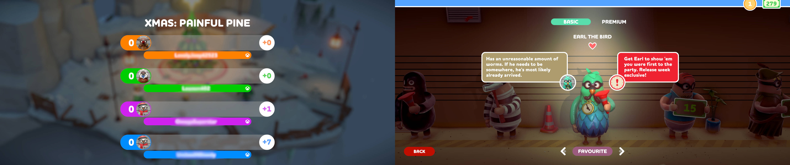

## Rubber Bandits UI fix for ultrawide and wider

The tool adjusts the user interface for better scaling at ultrawide and wider resolutions, ensuring that no elements are out of view at the score and other screens.

1. [Download](/../../releases) and unpack the archive.
2. Launch the game first, followed by the tool.
3. Press the hotkey as instructed.

All trainers based on CE components may trigger some anti-virus software.

Tested on the latest Microsoft Store version at 2560x1080.

You can buy me a [coffee](https://ko-fi.com/rozziroxx) or become a [patron](https://www.patreon.com/rozzi).

